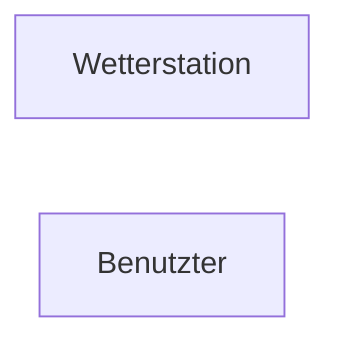
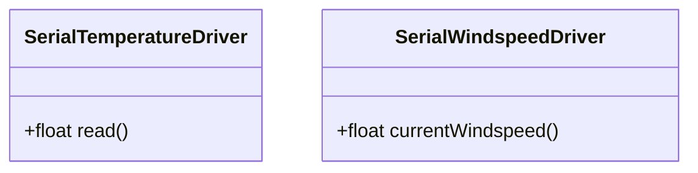
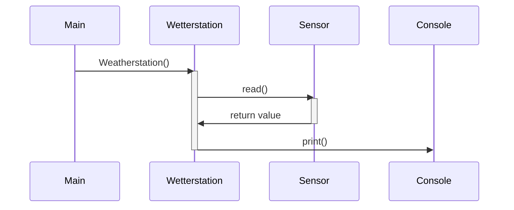

# Wetterstation

## Ansichten

### Kontextabgranzung

```mermaid
flowchart LR
    Wetterstation
    Benutzter
```

### Klassendiagramm

```mermaid
classDiagram
    class SerialTemperatureDriver{
        +float read()
    }
    class SerialWindspeedDriver{
        +float currentWindspeed()
    }
```

### Sequenzdiagramm

```mermaid
sequenceDiagram
    Main->>Wetterstation: Weatherstation()
    activate Wetterstation
    Wetterstation->>Sensor: read()
    activate Sensor
    Sensor->>Wetterstation: return value
    deactivate Sensor
    Wetterstation->>Console: print()
    deactivate Wetterstation
```
